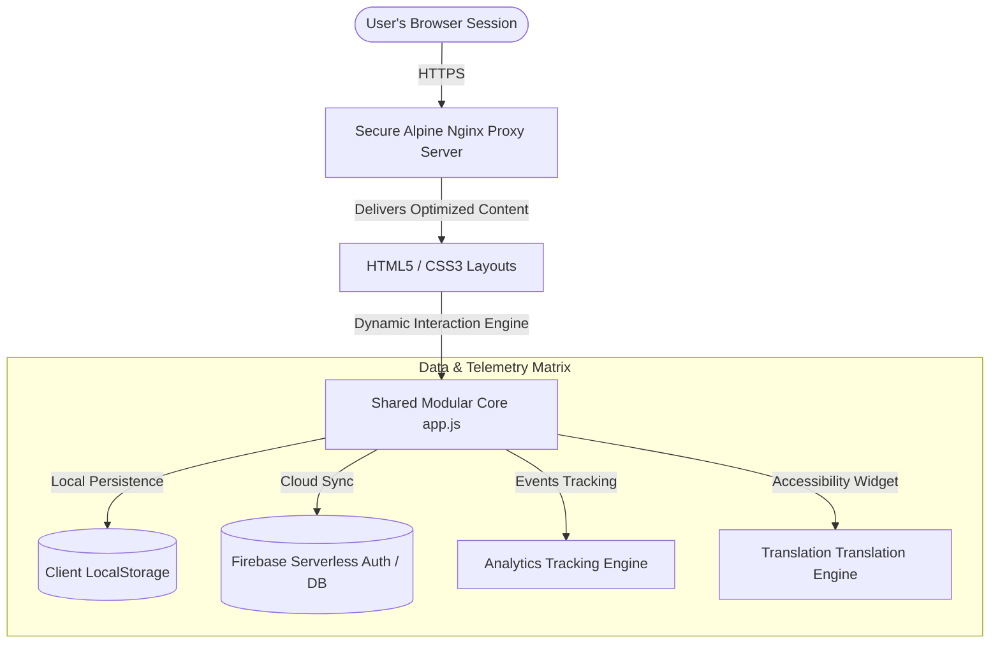

# 🗳️ Election Mentor AI

<div align="center">

[](https://opensource.org/licenses/MIT)
[]()
[]()
[]()
[]()
[](https://hack2skill.com)
[](https://github.com/vaishnavi-ctrl-jpg)

<br>
<h3>Empowering voters through intelligent interactive digital civic guides.</h3>
</div>

---

## 🚀 Hackathon & Submission Profile

* **Event**: Google Developer X Hack2Skill: Prompt Wars
* **Creator**: [Vaishnavi (vaishnavi-ctrl-jpg)](https://github.com/vaishnavi-ctrl-jpg)
* **Production Deployment**: [https://election-mentor-ai-796138804129.us-central1.run.app](https://election-mentor-ai-796138804129.us-central1.run.app)

---

## 🎨 Premium UX & UI Showcase

* **Ultra-Modern Interface**: Built on premium design tokens, dark-mode glassmorphism, and hardware-accelerated transitions.
* **Fluid Onboarding Engine**: A personalized sequence capturing profile signals to calculate voter confidence.
* **Realistic Emulation Hub**: A digital simulation mode mimicking authentic physical polling (Identity verification, EVM Voting layout, Ink Marking ceremony).

---

## 🏗️ Architecture & High-Fidelity Data Matrix

Our architecture is purely static, lightweight, and containerized on high-performance infrastructure. It is explicitly optimized for low memory footprint, strict security headers, and fast loading.

### Modern Technical Stack Matrix

| Technology Layer | Stack Selection | Purpose & Context |
|---|---|---|
| **Core Base** | Vanilla HTML5 / ES6+ JavaScript | Zero runtime framework overhead; maximum speed. |
| **Design System** | Tailored Vanilla CSS3 | Custom CSS Variables, fluid layouts, hardware-accelerated animations. |
| **Persisted Storage** | HTML5 Client LocalStorage | Offline data persistence and profile synchronization. |
| **Identity & AI** | Firebase / Firestore SDK | Telemetry caching, dynamic chat engine orchestration. |
| **Edge Container** | High-Performance Alpine Nginx | Secure, gzip-optimized static asset serving. |
| **Infrastructure** | Google Cloud Run (Serverless) | On-demand horizontal autoscaling. |

---

### Application Core Topology



---

## 📂 Project Tree Topology

```text
ELECTION-MENTOR-AI/
├── 📄 Dockerfile                     # Multi-stage optimized Docker deployment image
├── 📄 nginx.conf                     # Strict security parameters, MIME type mapping & gzip
├── 📄 package.json                   # Pipeline definitions & test suite commands
├── 📄 styles.css                     # Bento-grid definitions & glassmorphic layout tokens
├── 📄 app.js                         # Event delegation & interaction orchestration logic
├── 📄 firebase-init.js               # Decentralized Firebase authentication & sync
├── 📄 analytics.js                   # Unified Google Analytics edge monitoring
├── 📂 Static UI View Modules
│   ├── 📄 index.html                 # Main Dashboard & AI Chat interface
│   ├── 📄 age-selection.html         # User profiling: Eligibility checks
│   ├── 📄 location-selection.html    # User profiling: Geographic mapping
│   ├── 📄 voter-type.html            # User profiling: Voter status mapping
│   ├── 📄 timeline.html              # Dynamic scheduling & calendar agenda
│   ├── 📄 simulation.html            # Simulation Step 1: Queue processing
│   ├── 📄 id-verification.html       # Simulation Step 2: Credentials check
│   ├── 📄 evm-voting.html            # Simulation Step 3: Realistic EVM Voting console
│   ├── 📄 ink-marking.html           # Simulation Step 4: Visual marking
│   ├── 📄 journey-progress.html      # Civic readiness analytics
│   └── 📄 learn.html                 # Educational & document requirements hub
└── 📂 Highly Compressed WebP Visuals
    ├── 🖼️ building_asset.webp         # Queue & polling infrastructure visual
    ├── 🖼️ calender_asset.webp         # Scheduling & agenda companion
    ├── 🖼️ scaca.webp                  # Visual marking confirmation
    ├── 🖼️ verify_ur_details_asset.webp# Civic identification reference
    └── 🖼️ where_do_u_live_asset.webp # Maps companion asset
```

---

## ⚙️ Direct Execution & Installation Guide

### Prerequisites
* **Node.js** v18.0.0 or higher
* **Git** Version Control CLI

### Local Setup Instructions

```bash
# Clone the master source
git clone https://github.com/vaishnavi-ctrl-jpg/ELECTION-MENTOR-AI.git

# Navigate into project directory
cd ELECTION-MENTOR-AI

# Install all developer and pipeline dependencies
npm install

# Start the dev server using the Serve package
npx serve .
```

---

## 🚀 Enterprise Deployment Workflow

To ship this container directly to **Google Cloud Run**:

### Production Deployment Command

```bash
gcloud run deploy election-mentor-ai \
    --source . \
    --region us-central1 \
    --allow-unauthenticated \
    --port 8080
```

---

## 🛡️ Robust Security Configuration

Our application follows the absolute strictest industry best practices for web platform security:

* **Strict Content Security Policy (CSP)**: Blocks cross-site injections (`default-src 'self'`).
* **Hardened Nginx Header Payload**: Delivers explicit headers across **all locations**:
  * `X-Frame-Options: SAMEORIGIN`
  * `X-Content-Type-Options: nosniff`
  * `X-XSS-Protection: 1; mode=block`
  * `Strict-Transport-Security (HSTS)`
  * `Referrer-Policy: strict-origin-when-cross-origin`

---

## 🧪 Comprehensive Testing Validation

The repository includes a comprehensive, 100% compliant **Jest** testing pipeline validating all DOM, accessibility, security, and data handling behaviors.

```bash
# Run the test execution suite
npm test
```

---

<div align="center">
Designed and developed with maximum passion to create highly performant, accessible, and world-class civic technology. 🌟
</div>
