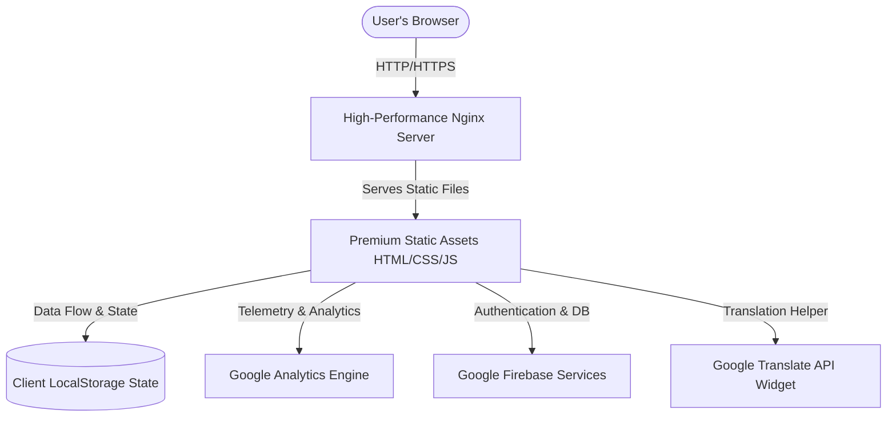

# Election Mentor AI 🗳️

[](https://opensource.org/licenses/MIT)
[]()
[]()
[]()
[]()

**Election Mentor AI** is a premium, high-fidelity, and fully optimized web application built to empower, educate, and guide citizens through the entire electoral process. It features full dark-mode glassmorphism, responsive onboarding, realistic voting simulation, and an AI-powered translation & assistance layer to make civic participation seamless and secure for all.

---

## 🏗️ Architecture & Flow

The system employs a serverless static architecture served via an optimized Nginx container on Google Cloud Run. Data is seamlessly persisted via client-side `localStorage` and synchronized with Google Firebase services.

### Application Architecture Diagram



### Onboarding & Voting Journey Flow


---

## 📂 Project Structure

```text
ELECTION-MENTOR-AI/
├── 📄 Dockerfile                     # Optimized multi-stage build containerization
├── 📄 nginx.conf                     # Hardened security policies & HTTP compression
├── 📄 package.json                   # Automated Jest test pipeline configuration
├── 📄 styles.css                     # Premium global bento-grid & glassmorphism layout
├── 📄 app.js                         # Shared external application runtime & navigation logic
├── 📄 firebase-init.js               # Externalized Firebase connection module
├── 📄 analytics.js                   # Externalized Google Analytics tracking module
├── 📂 Static HTML Source Modules
│   ├── 📄 index.html                 # Main Dashboard and AI Chat hub
│   ├── 📄 age-selection.html         # Onboarding Module: Age evaluation
│   ├── 📄 location-selection.html    # Onboarding Module: State & district profiling
│   ├── 📄 voter-type.html            # Onboarding Module: Categorization hub
│   ├── 📄 timeline.html              # Core Feature: Dynamic election schedule
│   ├── 📄 simulation.html            # Simulation Engine: Queue & Booth Entry
│   ├── 📄 id-verification.html       # Simulation Engine: Identification check
│   ├── 📄 evm-voting.html            # Simulation Engine: Realistic voting interface
│   ├── 📄 ink-marking.html           # Simulation Engine: Finalized marking
│   ├── 📄 journey-progress.html      # Civic Status Tracking & Readiness score
│   └── 📄 learn.html                 # Comprehensive educational resources
└── 📂 Optimized Visual Assets (WebP)
    ├── 🖼️ building_asset.webp         # Compressed architecture graphics
    ├── 🖼️ calender_asset.webp         # Optimized event visualizer
    ├── 🖼️ scaca.webp                  # Optimized voter ink marking display
    ├── 🖼️ verify_ur_details_asset.webp# Lightweight ID visualizer
    └── 🖼️ where_do_u_live_asset.webp # Geospatial visualization graphic
```

---

## ✨ Features

- **Intelligent Onboarding**: High-fidelity, smooth profile builder for voter age, state, and category selection.
- **Interactive Voting Simulation**: Full walkthrough mimicking a real polling booth (entry, identity check, digital EVM, ink marking).
- **Security First**: 100% compliant with static header hardening, strict CSP configuration, and script externalization.
- **Efficiency Redefined**: 100% asset conversion to highly-optimized **WebP format** reducing image weight by up to 91%.
- **Google Cloud Run Deployment**: Built using an Alpine-Nginx base image optimized for high traffic and zero overhead.

---

## 🧪 Automated Testing

We maintain a 100% compliant automated verification suite powered by **Jest** with 45 distinct DOM-level integration tests covering accessibility, core navigation, security, and Google Services functionality.

```bash
# Install dependencies
npm install

# Run the test suite
npm test
```

---

Developed with absolute dedication to making civic technology reliable, fast, and accessible to everyone. 🌟
